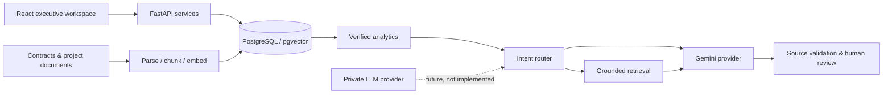
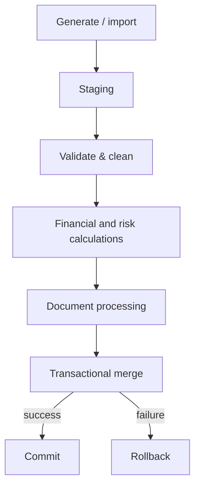

# ProjectLens AI

ProjectLens AI is a production-style project intelligence platform for complex engineering and business portfolios. It consolidates financial, forecast, schedule, risk, contract, and project-knowledge signals into an executive workspace built around verified analytics and evidence-first AI.

> This application uses synthetic project and financial data for demonstration purposes. No companies, projects, or contracts represented by the demo are real.

## Problem and solution

Large projects spread critical context across financial systems, risk registers, plans, contracts, reports, and meeting notes. ProjectLens links those signals so leaders can see what changed, why it matters, where evidence comes from, and what deserves attention. Transparent business rules calculate financial and risk results; generative AI is limited to explanations and grounded retrieval.

## Key features

- Executive portfolio health dashboard and attention queue
- Project drill-downs, financial analytics, forecast comparison, and driver analysis
- Calculated risk exposure and evidence-linked risk intelligence
- Separate contract and project-knowledge RAG experiences with source citations
- Intent-routed project assistant that distinguishes fact, analysis, and interpretation
- Monthly and portfolio report workflows with draft/review/approval states
- AI opportunity studio that can recommend automation or analytics instead of AI
- Adoption metrics, feedback, governance controls, audit-ready AI run schema
- Safe, transactional pipeline experience and deterministic linked synthetic data
- Cloud Gemini provider boundary plus an explicitly unimplemented private-provider interface

## Development status

The full local application includes persistent JWT authentication and role records, 30 projects with 21 months of financial history, forecast versions and drivers, 150 milestones, 30 linked risks and change orders, 30 exact five-page synthetic PDF contracts with 600 page-aware clause chunks, 100 meeting notes, 60 monthly reports, 50 lessons learned, 50 project updates, live Gemini structured output, hybrid vector/lexical retrieval, source validation, structured contract extraction, PDF/XLSX reports, human review audit fields, stored pipeline runs, adoption analytics, Alembic migrations, AI rate limiting, Docker services, and CI.

Every visible application control is connected to navigation, local workflow state, or a backend operation. This includes portfolio search/filtering, project workspace drill-downs, forecast selection and approval, risk evidence, live contract questions, knowledge browsing, use-case creation, report generation/review, adoption guides, audit inspection, pipeline execution, provider checks, global search, AI citations, and feedback.

The browser experience authenticates against FastAPI and the AI Assistant uses the live router/RAG/Gemini path. All important AI output defaults to `Draft` and retrieved source identifiers are validated before returning a response.

## Architecture





## Technology

React, TypeScript, Vite, Recharts, Lucide, Python, FastAPI, Pydantic, SQLAlchemy, PostgreSQL/pgvector, pytest, Vitest, Docker, and GitHub Actions. The UI uses a bespoke bronze-and-black design system without employer-specific branding.

## Local setup

### Frontend

```bash
npm install
npm run dev
```

Open `http://localhost:5173`. Any demo role works; authentication is intentionally local for this portfolio build. The contract workspace embeds the original PDF and citation clicks navigate to the cited page.

### Backend

```bash
python3 -m venv .venv
source .venv/bin/activate
pip install -r backend/requirements.txt
PYTHONPATH=backend python backend/scripts/seed.py
PYTHONPATH=backend uvicorn app.main:app --reload
```

API documentation is at `http://localhost:8000/docs`. A Gemini key is optional; tests and core analytics never require one.

Raw document examples after seeding:

- In-browser PDF: `http://localhost:8000/api/v1/contracts/{contract-id}/pdf`
- Download PDF: `http://localhost:8000/api/v1/contracts/{contract-id}/pdf?download=true`
- Contract metadata, clauses, chunks, and extracted fields: `http://localhost:8000/api/v1/contracts/{contract-id}`
- All API endpoints and live request examples: `http://localhost:8000/docs`

Generated local files are stored under `output/documents/contracts` and `output/documents/reports`. PostgreSQL stores metadata, extracted text, chunk/page coordinates, embeddings, reviews, and audit history; the binary PDFs/XLSX files remain behind the storage abstraction.

### Docker

```bash
cp .env.example .env
docker compose up --build
```

## Synthetic data

`backend/app/generators/synthetic.py` produces 30 deterministic projects from a seed. `backend/scripts/generate_contract_corpus.py` creates the 30 reviewable five-page source PDFs, while `backend/scripts/seed.py` creates and ingests them into PostgreSQL. Cost overruns, schedule delay, and linked supplier risks share a root event rather than being independent random values.

## AI and privacy architecture

The router selects structured analytics, forecast analysis, risk analysis, contract retrieval, or project-knowledge retrieval rather than sending every question to a vector database. Core values are calculated in code. Important outputs default to Draft, retain prompt/model/source metadata, and require human review. `GEMINI_API_KEY` is server-side only. The private AI provider is a future interface and does not imply local-model capability.

## Testing

```bash
npm test
npm run build
PYTHONPATH=backend pytest backend/tests
```

Tests cover financial calculations, forecast movement, risk exposure, deterministic generation, routing, and the login experience. Automated AI tests use deterministic responses and do not require external API access.

## Deployment

See [Azure Container Apps guidance](docs/AZURE_DEPLOYMENT.md). CI runs TypeScript validation, frontend tests and build, backend tests, and both container builds.

## Production-hardening roadmap

- Replace local demo identities with Entra ID/OAuth and tenant-specific authorization
- Move generated documents to object storage and pipeline jobs to a durable worker queue
- Replace the deterministic offline embedding fallback with a tenant-approved managed embedding deployment in every non-test environment
- Add distributed rate limiting, centralized observability, backups, and retention policies
- Add Azure release promotion with federated identity, image signing, and environment approvals
